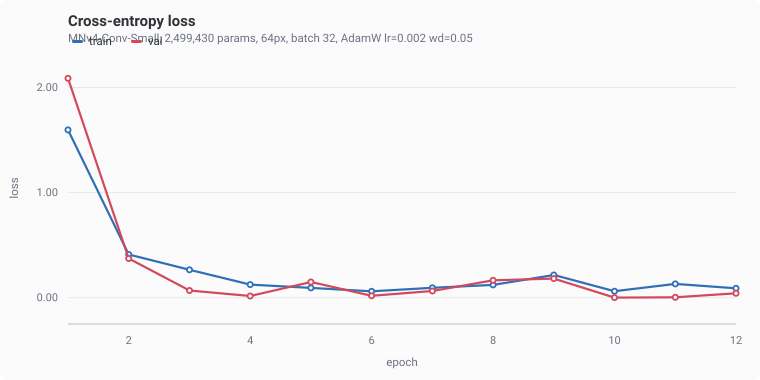
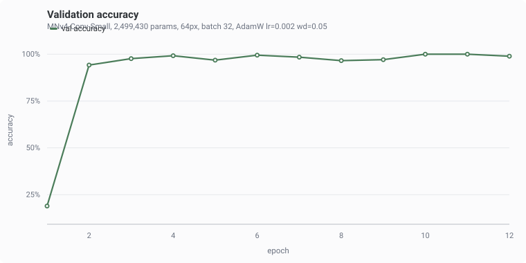
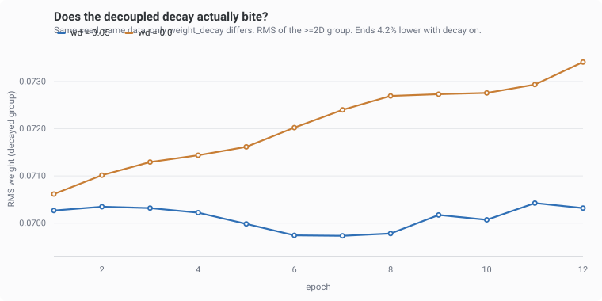

## Mobile*Pet*V4

my pet project -> replicating the MNv4 architecture from scratch in python.
first time touching attention mechanisms, a good new skill.

torch gives me tensors, `unfold`/`fold` and the autograd tape. everything else is
written here: no `nn.Conv2d`, no `nn.BatchNorm2d`, no `F.cross_entropy`, no
`torch.optim`. every backward pass is one I derived.

### layout

```
Blocks/<Name>/block.py    autograd.Function, hand-written forward + backward
Blocks/<Name>/module.py   the nn.Module that owns the parameters
model/mnv4.py             config table + the builder that turns it into modules
training/                 AdamW, param grouping, train/eval loop, mock data
scripts/                  demo runner, chart generator
```

MNv4-Conv-Small builds to 3,772,744 params at 1000 classes. paper says ~3.8M.

### optimizer

`training/optimizer.py` is AdamW written from the paper. checked against
`torch.optim.AdamW` over 200 steps, same init and same gradients:

| weight_decay | float32 | float64 |
| --- | --- | --- |
| 0.0 | 2.4e-07 | 4.4e-16 |
| 0.01 | 8.8e-06 | 7.1e-15 |
| 0.1 | 5.7e-06 | 8.9e-16 |

float64 lands on machine epsilon, so the float32 column is rounding and not error.

`training/sort_params.py` splits parameters on `p.dim() >= 2`, so conv kernels and
weight matrices get decayed and biases, BN gamma and beta do not.

### running it

```
python scripts/train_demo.py
python scripts/plot_run.py
```

six generated shape classes at 64px, nothing to download. 12 epochs, 2.7 min on
CPU, 15.3% at init up to ~99%.





the decay is invisible in a single run, the gradient updates are far bigger than
`lr*wd`. so: same seed, same data, only `weight_decay` differs.

```
python scripts/train_demo.py --wd 0.0 --out runs/nodecay
```



charts are hand-written SVG so the repo does not pull in matplotlib for three line
plots.

### not done

- MQA is written but not wired into the model. `MobileMQA` takes raw weight shapes
  instead of channel counts and hardcodes `kv_stride=2`, needs a refactor first.
- `FusedInvertedBottleneck.forward` references `self.b_project`, which `__init__`
  never defines. UIB made it mostly redundant so I have not decided whether to fix
  or delete it.
- `tests/` is empty.
- no LR schedule, no optimizer `state_dict`, never trained on real images.
